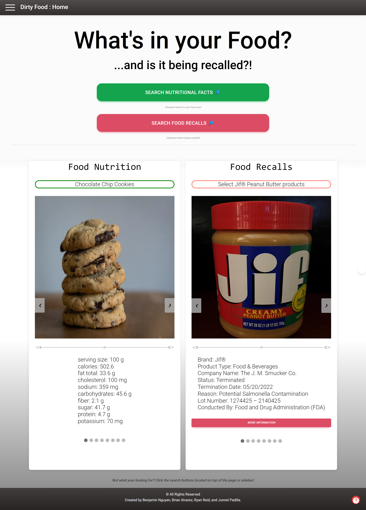
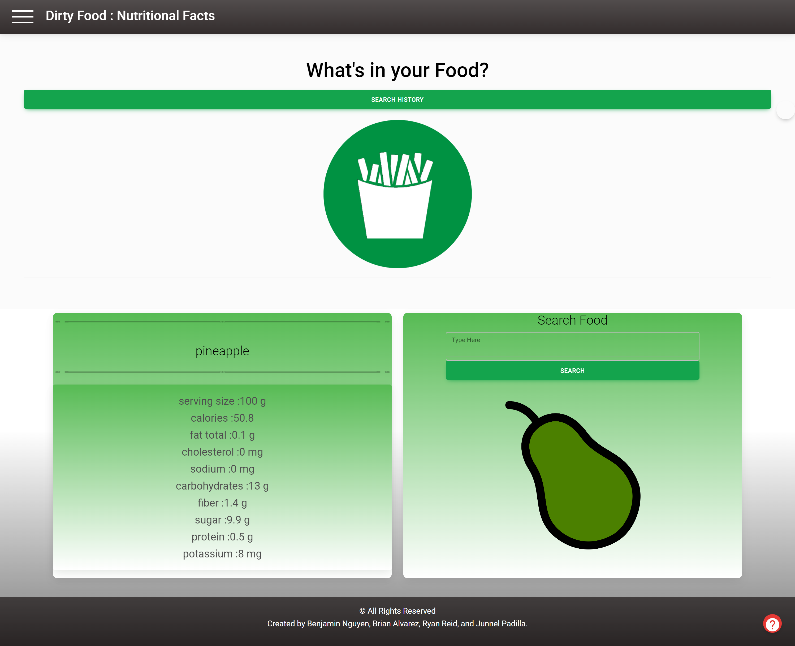
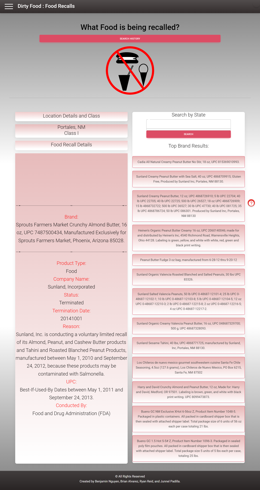
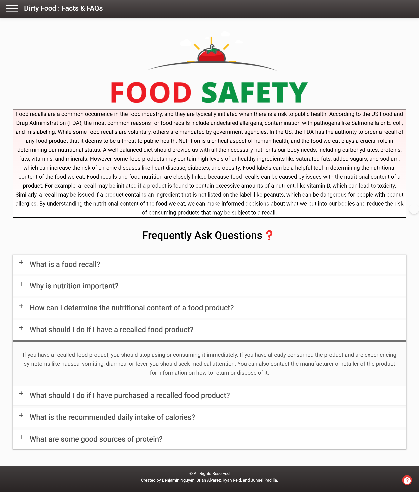
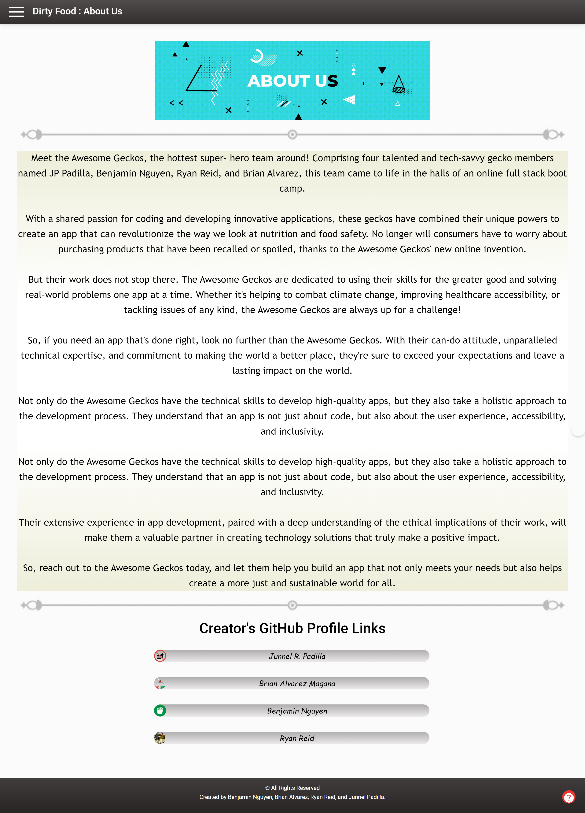

# Dirty Foods

## Usage

Are you curious about how much calories, protein or fat your eating? Are you also curious if the food your buying is has been recalled? Well this app is perfect for you!
Our app gives user the tools to check nutritional facts and as well as food recalls. This is an everyday use and a great app and easy to navigate. which just na few click 
and a few keywords for searching, this app will show you what you are looking for. so try it out now!

## Description

Our app that we created includes a landing page, that contains a few suggestions for the user with both nutritional facts and food recall information. This landing also includes 
buttons to navigate user to different pages as well as a side bar with animation when hover. As the user goes to every page, there will be different and fun little loading pages.
Overall, our app contains a nutritional facts page where a user can search for a specific food and will give information for each search. It also includes a food recall page where 
a user can search for any food recalls. We also included a facts page, and FAQs in one that shows information about food safety and also frequently ask questions. lastly, we also 
included about us page to give user a little information about us and it also include our links to our GitHub profiles. 

## URL

https://brianalvarezmagana.github.io/Project_01/

## Screenshots

Landing Page

Nutritional Facts Page

Food Recall Page

Facts & FAQs Page

About Us Page

## Credits

Junnel R. Padilla, Brian Alvarez Magana, Benjamin Nguyen, Ryan Reid, pixabay, chatGPT, ww3schools, stackoverflow, google, youtube. github

## License

MIT License

Copyright (c) 2023 Junnel R. Padilla, Brian Alvarez Magana, Benjamin Nguyen, Ryan Reid

Permission is hereby granted, free of charge, to any person obtaining a copy of this software and associated documentation files (the "Software"), to deal in the Software without restriction, including without limitation the rights to use, copy, modify, merge, publish, distribute, sublicense, and/or sell copies of the Software, and to permit persons to whom the Software is furnished to do so, subject to the following conditions:

The above copyright notice and this permission notice shall be included in all copies or substantial portions of the Software.

THE SOFTWARE IS PROVIDED "AS IS", WITHOUT WARRANTY OF ANY KIND, EXPRESS OR IMPLIED, INCLUDING BUT NOT LIMITED TO THE WARRANTIES OF MERCHANTABILITY, FITNESS FOR A PARTICULAR PURPOSE AND NONINFRINGEMENT. IN NO EVENT SHALL THE AUTHORS OR COPYRIGHT HOLDERS BE LIABLE FOR ANY CLAIM, DAMAGES OR OTHER LIABILITY, WHETHER IN AN ACTION OF CONTRACT, TORT OR OTHERWISE, ARISING FROM, OUT OF OR IN CONNECTION WITH THE SOFTWARE OR THE USE OR OTHER DEALINGS IN THE SOFTWARE.